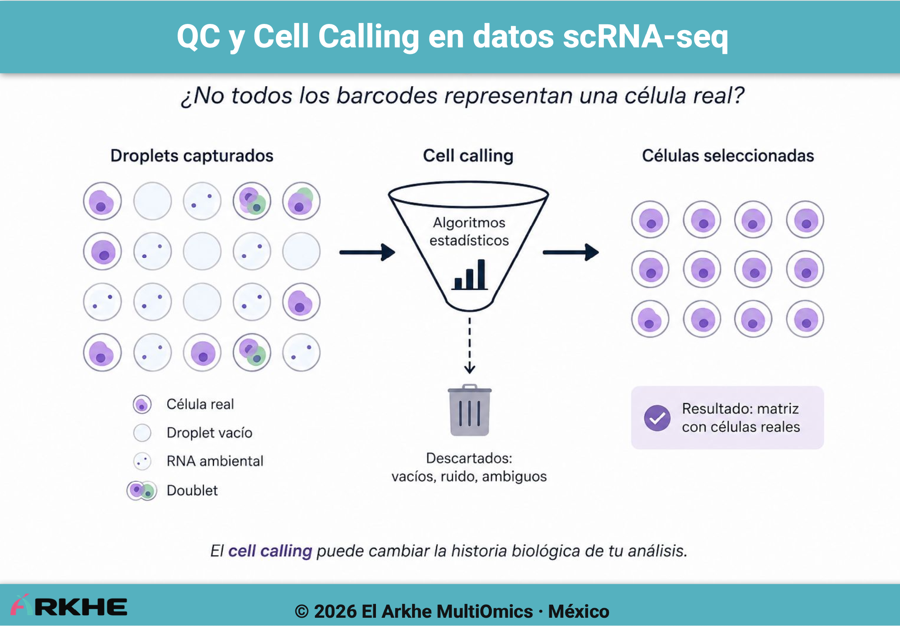
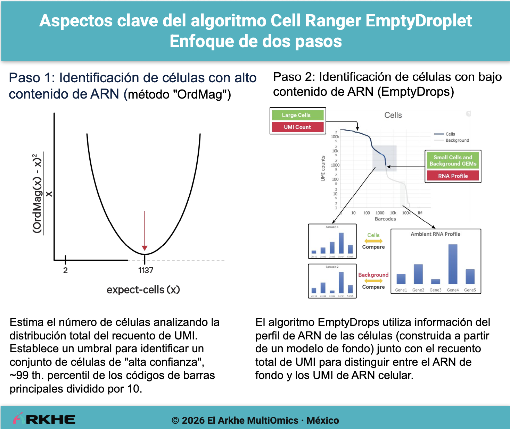

Author: *Cynthia SC* (05-14-2026)

⏱️ Tiempo de lectura aproximado: 10 min

---

## <span class="gradient-heading">Cell Calling en scRNA-seq</span>
{: .no_toc }
### Por qué un barcode "no" siempre representa una célula real
{: .gradient-heading .no_toc }

## Contenido
{: .no_toc }

1. TOC
{:toc}

   

## Una idea peligrosa sobre scRNA-seq
{: .gradient-heading .toc }

Uno de los errores más frecuentes al comenzar en análisis *single-cell RNA-seq* es asumir que:

```text
1 barcode = 1 célula
````

En realidad, esto no siempre es cierto.

En tecnologías *droplet-based* como **10x Genomics**, el experimento genera millones de droplets, pero muchos de ellos:

* están vacíos
* contienen RNA ambiental
* contienen múltiples células (*doublets*)
* o presentan señales ambiguas

<br>



Por ello, antes del análisis biológico, existe una etapa crítica llamada `cell calling`

es decir:

> decidir qué barcodes representan células reales y cuáles NO.

   

## Entonces… ¿qué es realmente un barcode?
{: .gradient-heading .toc }

En tecnologías *droplet-based*, cada droplet recibe un identificador molecular conocido como `cell barcode`. Este barcode permite asociar lecturas de secuenciación a un droplet específico.

El detalle importante es que:

> un barcode identifica un droplet, NO necesariamente una célula.

Por ello, una matriz *raw* típica puede contener:

```text
1,000,000+ barcodes
```

aunque solamente una fracción corresponde a células reales.

   

## ¿Qué significa <i>droplet-based</i>?
{: .gradient-heading .toc }

Las tecnologías *droplet-based* buscan encapsular células individuales dentro de gotas microscópicas (*droplets*) utilizando sistemas microfluídicos.

Idealmente se quiere una equivalencia, `1 droplet → 1 célula`

Sin embargo, la realidad experimental es mucho más compleja y cada droplet contiene:

* una célula (idealmente), no siempre es así
* reactivos de retrotranscripción
* un barcode celular
* UMIs (*Unique Molecular Identifiers*)
   

### El problema: es que "no" todos los droplets contienen células
{: .no_toc }

En la práctica, un experimento *droplet-based* genera una mezcla de droplets vacíos, droplets con una célula, droplets con múltiples células (*doublets/multiplets*) y droplets contaminados con RNA ambiental libre (*ambient RNA*).

Por ello, los datos sin procesar contienen millones de barcodes cuya composición real no se conoce inicialmente.

Por ejemplo, una matriz `raw_feature_bc_matrix.h5` típica puede contener:

```text
1,389,510 droplets × 38,606 genes
```

aunque la mayoría de esos droplets están vacíos.

Cuando observamos matrices sin filtrar, en realidad estamos viendo una mezcla compleja de señales biológicas y técnicas, que pueden resumirse como sigue:

| Problema              | Descripción                           |
| --------------------- | ------------------------------------- |
| Empty droplets        | Barcodes sin células reales           |
| Ambient RNA           | RNA libre capturado accidentalmente   |
| Doublets              | Dos o más células encapsuladas juntas |
| Barcode contamination | Señales espurias entre droplets       |


En este contexto, el *cell calling* intenta **reconstruir correctamente qué señales corresponden a biología real**.

   

## Cell Ranger ya realiza <i>cell calling</i>
{: .gradient-heading .toc }

`Cell Ranger` implementa algoritmos estadísticos para decidir qué droplets contienen células reales. De forma simplificada sigue el siguiente flujo:

```text
raw matrix
 ↓
estimación de RNA ambiental
 ↓
detección estadística de droplets celulares
 ↓
filtered matrix
```

Se describen resumidamente en la siguiente figura:



<br>

Es decir, despues del cell calling, `Cell Ranger` genera una matriz filtrada (`filtered_feature_bc_matrix.h5`) que contiene únicamente los barcodes que se consideran células reales:

Por ello muchos usuarios la utilizan directamente:

```text
filtered_feature_bc_matrix
```

Aunque... algunas veces convendrá preguntarse:

* ¿cómo fueron seleccionados esos barcodes?
* ¿qué criterios utilizó Cell Ranger?
* ¿qué barcodes quedaron fuera?
* ¿qué impacto tiene esto en downstream analysis?

esto, será particularmente relevante en experimentos con datos de alta complejidad.


### Y aquí, una pregunta importante
{: .no_toc }

¿Debemos aceptar siempre los barcodes seleccionados automáticamente?

La respuesta corta es, "depende del experimento"

En algunos datasets:

* Cell Ranger puede ser demasiado conservador
* células raras pueden perderse
* poblaciones de baja expresión pueden desaparecer
* o el RNA ambiental puede afectar la selección

Por ello, muchos análisis avanzados exploran también la matriz *raw*.

   

## EmptyDrops y el modelado de RNA ambiental
{: .gradient-heading .toc }

Una de las herramientas más conocidas para este problema es `EmptyDrops`, propuesta por Lun et al. (2019).

Aquí, la idea conceptual:
1. *comparar cada barcode contra el perfil de RNA ambiental esperado*.
2. Si el barcode presenta una señal significativamente distinta del ambiente, probablemente contiene una célula real.

Esto permite detectar:

* células de baja expresión
* poblaciones raras
* droplets ambiguos
* señales que podrían perderse en filtros automáticos

   

### ¿Puede estó cambiar un análisis?
{: .no_toc }

La selección de barcodes puede modificar:

* número total de células
* composición celular
* detección de poblaciones raras
* clustering
* análisis diferencial
* interpretación biológica

En otras palabras:

> el *cell calling* puede cambiar completamente la historia biológica que observamos.

Y este es uno de los motivos por los cuales esta etapa es mucho más importante de lo que muchos tutoriales sugieren.

   

## No todas las tecnologías generan droplets
{: .gradient-heading .toc }

Es importante recordar que no todas las plataformas de scRNA-seq utilizan droplets.

Existen múltiples arquitecturas experimentales y cada una produce datos con propiedades distintas.

| Tipo de tecnología | Ejemplo                        |
| ------------------ | ------------------------------ |
| Droplet-based      | 10x Genomics, Drop-seq, inDrop |
| Plate-based        | Smart-seq2                     |
| Microwell-based    | Seq-Well                       |

Esto es importante porque muchas herramientas modernas fueron diseñadas específicamente para tecnologías *droplet-based*.

   

### Ejemplo: Smart-seq2
{: .toc }

Las tecnologías *plate-based* funcionan de manera distinta. Por ejemplo, en **Smart-seq2**:

* cada célula se deposita individualmente en un pozo
* no existen millones de droplets vacíos
* el RNA ambiental tiene un comportamiento distinto
* no se requiere *cell calling*

Por ello, herramientas como `EmptyDrops` no tienen sentido en estos datasets.

   

## Herramientas especializadas para tecnologías <i>droplet-based</i>
{: .gradient-heading .toc }

Muchas herramientas modernas de scRNA-seq fueron desarrolladas específicamente para resolver problemas característicos de tecnologías *droplet-based*.

| Problema        | Herramienta típica       | ¿Qué hace?                                    |
| --------------- | ------------------------ | --------------------------------------------- |
| Droplets vacíos | EmptyDrops / Cell Ranger | Identifica droplets con células reales        |
| RNA ambiental   | SoupX                    | Corrige contaminación por RNA ambiental       |
| Doublets        | scDblFinder              | Detecta múltiples células en un mismo droplet |

Estas herramientas NO son universales, y dependen fuertemente del tipo de tecnología utilizada.

Comprender la arquitectura experimental evita aplicar herramientas incorrectas simplemente porque aparecen en un tutorial o pipeline popular.

   

## Relación conceptual con Seurat
{: .gradient-heading .toc }

Es importante enfatizar que Seurat es una plataforma de análisis *downstream* y no reemplaza las etapas iniciales de preprocesamiento experimental.

El flujo conceptual correcto es:

```text
FASTQ
 ↓
alignment / counting
 ↓
cell calling
 ↓
normalización
 ↓
clustering
 ↓
análisis downstream
```

Por ello:

* `EmptyDrops` pertenece a la fase de *cell calling*
* Seurat comienza típicamente después de esta etapa

   

### Lo importante no es memorizar herramientas
{: .toc }

La verdadera pregunta en scRNA-seq no es:

> “¿Qué comando debo correr?”

Sino:

> “¿Qué representa realmente este barcode?”

Comprender esto cambia completamente la forma de analizar datos *single-cell*.

   

## Aprender single-cell más allá de los pipelines
{: .gradient-heading .toc }

Gran parte de los tutoriales modernos muestran únicamente:

```text
Read10X()
→ CreateSeuratObject()
→ NormalizeData()
→ RunUMAP()
```

Pero rara vez explican:

* qué ocurrió antes
* cómo fueron seleccionadas las células
* qué decisiones estadísticas tomó el pipeline
* o qué sesgos podrían introducirse

Comprender estas etapas mejora enormemente la interpretación biológica y evita aplicar herramientas como si fueran universales.

---   

## Recursos de consulta
{: .no_toc }

* [10x Genomics — Cell Ranger Gene Expression Algorithm Overview](https://www.10xgenomics.com/support/software/cell-ranger/latest/algorithms-overview/cr-gex-algorithm)

* [Lun ATL et al. (2019) — EmptyDrops: distinguishing cells from empty droplets in droplet-based single-cell RNA sequencing data](https://genomebiology.biomedcentral.com/articles/10.1186/s13059-019-1662-y)

* [OSCA Advanced — Droplet Processing](https://bioconductor.org/books/release/OSCA.advanced/droplet-processing.html)

---

[](https://el-arkhe.github.io)


<p style="text-align:center">
© 2026 El Arkhe MultiOmics · México
</p>

