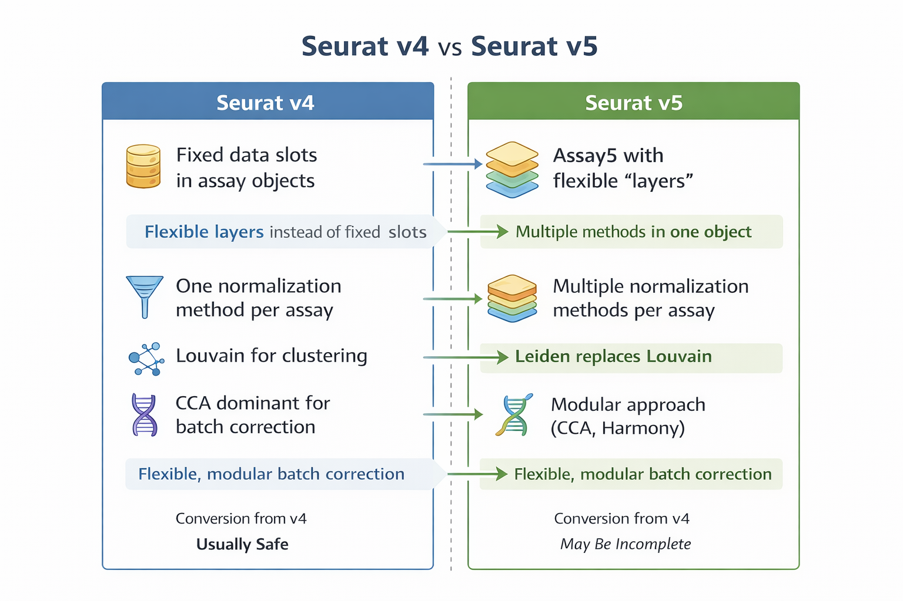
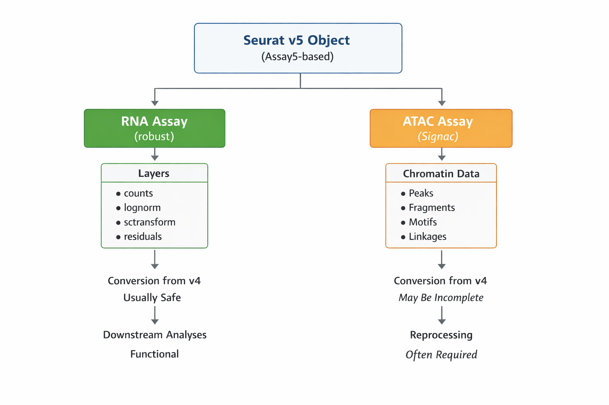

## Seurat v4 vs Seurat v5

Here I summarize the most relevant conceptual and structural changes introduced in **Seurat v5** compared to **Seurat v4**, with an emphasis on how these changes impact single-cell RNA-seq analysis workflows.

This notebook is intended to frame the new conceptual model behind Seurat v5 and its alignment with current best practices.

> **Versioning note**  
> This overview reflects Seurat v5.x behavior as of early 2026. Minor interface details may evolve across releases, but the core design principles described here are stable.

> Unless explicitly stated otherwise, examples and concepts discussed here refer primarily to **RNA assays**. Multimodal (RNA + ATAC) considerations are noted where relevant.

---

## What does Seurat v5 introduce?

Seurat v5 introduces an internal reorganization of the data object and the analysis workflow with the following goals:

- Improve **scalability** for large datasets  
- Facilitate **multimodal** analyses  
- Allow **methodological flexibility** in normalization and integration  
- Reduce **unnecessary data duplication** within the object  

These changes reflect a shift toward more modular, explicit, and comparable workflows.

---

## Main structural change: from ´Assay´ to ´Assay5´

### Seurat v4

- Each `Assay` contains fixed slots:
  - `counts`
  - `data`
  - `scale.data`
- A single normalization strategy per assay

### Seurat v5

- Introduces `Assay5` and the concept of **layers**
- Allows multiple representations of the same data within a single assay
- Explicit separation between:
  - raw data  
  - normalized data  
  - transformed data  

This design avoids object duplication and enables alternative analytical strategies without recomputing the entire workflow.

---

## The concept of layers in Seurat v5 

A **layer** represents a specific data representation within an assay. Common examples include:
- `counts`
- `lognorm`
- `sctransform`
- `pearson_residuals`

This structure provide us a key of advantages, now we can: 
- Compare different normalization methods within the same object  
- Modify downstream analyses without recomputing upstream steps  
- Enable methodological benchmarking  

---

## Normalization: conceptual differences between v4 and v5 

### Seurat v4

- Common workflows use `NormalizeData()` (methods: LogNormalize, CLR, RC) or `SCTransform()` as a separate variance-stabilizing normalization framework
- Normalization choice is typically exclusive and assay-bound

### Seurat v5

- The layer-based data model allows multiple normalized representations to coexist within the same assay
- External normalization strategies (e.g. scran, shifted-log) can be stored  as layers
- Pearson residuals are supported as first-class outputs in residual-based workflows
- Downstream analyses explicitly reference the layer being used, rather than inheriting assumptions from the assay

---

##  Additional workflow-relevant changes 

- **Feature selection**  
  Expanded from predominantly variance-based HVGs toward analytical, model-based approaches such as Pearson residuals and Deviance, while retaining variance-based methods.

- **Dimensionality reduction**  
  Decoupled from the assay and explicitly defined by layer, improving clarity and flexibility.

- **Clustering**  
  Shift from Louvain algorithm to Leiden as the default method, althought Louvain is still supported. This change push to get a better partition stability and faster convergence.

  Related resources reviewed on 2025, but still on practice:

<iframe width="560" height="315"
  src="https://www.youtube.com/embed/mE77X5G-3_8?si=T5y7vMFMFpFbQx99"
  title="YouTube video player"
  frameborder="0"
  allow="accelerometer; autoplay; clipboard-write; encrypted-media; gyroscope; picture-in-picture; web-share"
  allowfullscreen></iframe>

  [Ver presentación: Metodos de agrupamiento en datos multiome](https://speakerdeck.com/cyntsc/clustering-methods-in-multiome-scrna-seq-and-scatac-seq)

- **Differential analysis**  
  Growing emphasis on pseudobulk and donor-aware modeling, aligned with recent benchmarking studies, while retaining cell-level testing options

---

##  Summary comparison 

| Aspect | Seurat v4 | Seurat v5 |
|------|---------|---------|
| Data object | Fixed-slot Assay | Assay5 with layers |
| Data representations | One per assay | Multiple layers |
| Normalization | LogNormalize or SCTransform | Multiple stored representations (e.g. scran, residuals) |
| Feature selection | Variance-based HVGs | Pearson residuals and Deviance |
| Dimensionality reduction | Assay-coupled | Layer-defined |
| Default clustering | Louvain | Leiden |
| DGE | Mostly cell-level | Pseudobulk and mixed models |

---

##  What changes if I migrate today? 

| Aspect | If you stay on Seurat v4 | If you migrate to Seurat v5 |
|------|-------------------------|-----------------------------|
| Object structure | Fixed slots per assay | Assay5 with multiple layers |
| Normalization | One method per assay | Multiple normalization strategies within the same assay |
| Method comparison | Requires recomputation | Native support via layers |
| Clustering default | Louvain | Leiden |

##  Addendum: Signac workflows (RNA + ATAC) in Seurat v5 

While Seurat v5 provides a unified object model for multimodal data, **Signac-based chromatin workflows introduce additional constraints** that are important to keep in mind during migration.

Key considerations:

- **Chromatin assays are more sensitive to object conversion** than RNA assays  
  In particular, legacy objects created under Seurat v4 + Signac v1.x may not always retain full chromatin functionality when updated to Seurat v5.

- **Assay5 does not automatically guarantee chromatin compatibility**  
  A converted chromatin assay may exist structurally but fail downstream operations (e.g. peak-based reductions, motif analysis, or linkage steps).

- **Recommended practice**  
  For multimodal projects (RNA + ATAC), especially those involving:
  - peak calling  
  - TF motif analysis  
  - peak–gene linkage  

  it is often safer to **reconstruct the chromatin assay directly under Seurat v5 / Signac v2**, rather than relying on object conversion.

- **RNA assays are generally robust to conversion**, while ATAC assays benefit from explicit reprocessing.

This distinction is particularly relevant for large multiome datasets and for workflows that rely heavily on chromatin-specific reductions and annotations.

---

##  Alignment with Seurat v5.1+ developments 

The conceptual framework described in this notebook remains stable across Seurat v5 releases. However, recent versions (v5.1+) further reinforce the design principles introduced in v5.0.

These refinements include:

- More consistent handling of layers across functions
- Improved interoperability with external methods
- Clearer separation between data representation and analysis logic

---

I have found that Seurat v5.1+ have make a clear improvement toward transparent, modular, and benchmark-aligned workflows, rather than introducing breaking conceptual changes.

Users migrating from Seurat v4 are therefore encouraged to adopt the **layer-centric mindset early**, as it represents the stable direction of the framework going forward.

This notebook serves as a conceptual reference to understand these changes and to support informed decisions when designing new analyses or migrating existing projects.

---

##  Resources 

1. [Seurat v5 announcements and design overview](https://satijalab.org/seurat/articles/announcements.html)

2. [Seurat v5 Command Cheat Sheet (Assay5 + layers)](https://satijalab.org/seurat/articles/seurat5_essential_commands)

3. [Hafemeister & Satija (2019) – SCTransform](https://genomebiology.biomedcentral.com/articles/10.1186/s13059-019-1874-1)

4. [Crowell et al. (2020) – Benchmarking scRNA-seq analysis pipelines](https://genomebiology.biomedcentral.com/articles/10.1186/s13059-020-02136-7)

5. [Squair et al. (2021) – Best practices for differential expression in scRNA-seq](https://www.nature.com/articles/s41467-021-25960-2)

6. [Traag et al. (2019) – Leiden clustering algorithm](https://www.nature.com/articles/s41598-019-41695-z)

<!--
4. Lause, Berens & Kobak (2021) – Analytic Pearson residuals  
   https://www.nature.com/articles/s41467-021-25960-2
8. Stuart et al. (2019) – Seurat integration framework  
   https://www.cell.com/cell/fulltext/S0092-8674(19)30559-8
-->

---

CSC. February 2026
